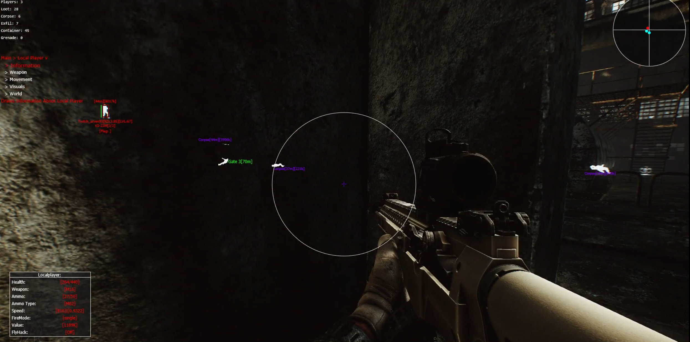

# EftHag
*Outdated, Last Update On My Legacy Branch Was 28 Jan 2023* 
This project started rather clean but turned into an absolute mess; by my standards, at least, I have seen A LOT of sources in an outright worse state than this one. Constant bandage fixes for stupid game bugs and testing game functions that outright do nothing ended up just making the source too messy for me to deal with so I reworked everything from the ground up. 

## Images/Videos:

## Fixes:
Include the SharpDX DLLs from [nuget](https://www.nuget.org/packages?q=Tags%3A%22SharpDX%22)

## Features:
